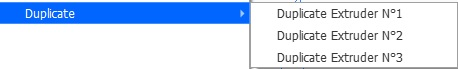

# Duplicate

Duplicate exturder settings for Cura in case of multi-extruder machine. Copy parameters that are different in :
- resolution
- shell (up to Cura 4.8)
- walls (from Cura 4.9)
- top/bottom (from Cura 4.9)
- infill
- material
- speed
- travel
- cooling
- dual
- experimental
- blackmagic
- meshfix

From one extruder to the others.

V1.0.4   -> Add the possibility to duplicate Datas for extruder :
- N°1
- N°2
- N°3

V1.0.6   -> If the Nozzles doesn't have the same diameter then Quality settings are not duplicate on the extruder settings :

V1.1.0   -> Update to Cura 5.0

V1.1.1   -> Change menu according to Extruder Machine NB (Work only on the active machine when Cura is loaded)
